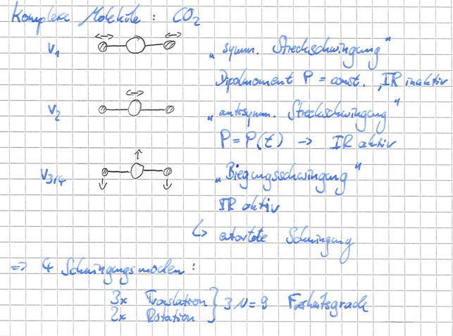

# Experimentalphysik V
 - [Inhaltsverzeichnis](https://uebungen.physik.uni-heidelberg.de/vorlesung/20172/pep5/toc)

----------------------------------------------------------------

----------------------------------------------------------------

# Molek&uuml;lbindung {.tabset}
## Kovalente Bindung
\begin{equation}
    E_g = K + A\\
    E_\omega = K - A\\
\end{equation}

(K: klassische Wechselwirkung, A: Austausch Wechselwikrung)

## Hybridisierung
\begin{equation}
    1s^2 2s^2 2p_x 2p_y \xrightarrow{\text{kostet Energie}} 1s^2 2s 2p_x 2p_y 2p_z
\end{equation}

# Molek&uuml;lanregungen
\begin{equation}
    E_{el} > E_{vib} > E_{rot}
\end{equation}

## Rotationsspektrum
\begin{equation}
    E_{rot} = \frac 1 2 I \omega^2 = \frac{L}{2I}
\end{equation}

Bsp. $^{12}C^{16}O$:
\begin{align}
    R =& 1.13\cdot10^{-8}\text m\\
    m_1(^{12}C) =& 1.99\cdot10^{-26}\text{kg}\\
    m_2(^{16}O) =& 2.66\cdot10^{-26}\text{kg}\\
    \mu =& 1.14\cdot10^{-26}\text{kg}\\
    I =& 1.46\cdot10^{-46}\text{kgm}^2\\\\
    E_{J=1} =& 0.48\text{meV}\\
    \omega =& \sqrt{\frac{E_{rot, J=1}}{I}} = 3.2\cdot10^{11}\text{Hz}
\end{align}

## Vibrationsanregungen

\begin{align}
    E_{vib} =& \hbar\omega (v + \frac 12),\quad v:\text{ Vibrationsquantenzahl}\\
    \omega =& \sqrt{\frac k \mu}, \qquad k:\text{ Bindungskonstante [$10^2$ N/m]}
\end{align}

### Raman-Streuung
(inelestische Streuung unter Vibrationsmodenanregung)

\begin{align}
    E =& E_0 \cos(\omega_0 t)\\
    \Rightarrow P(t) =& \alpha E_0 \cos(\omega_0 t)
\end{align}
falls sich bei Struungen $\alpha$ &auml;ndert, koppeln die Schwingungsmoden

\begin{align}
    \alpha(R) =& \alpha(R_0) + \partial_R(\alpha)(R-R_0) + \cdots\\
    R(t) =& R_0 + q \cos(\omega_0 t)
\end{align}

    (Rotations-Raman-Spektrum?)

## Elektronische Anregung
  

- keine Zentralsymmetrie
- Entartungen "teilweise" aufgehoben
- axiale Feldsymmetrie entlang der Kernverbindungslinie
- $l_Z = m_Z\hbar\quad \in \mathbb Z$
- $s,p,d,f \rightarrow \sigma, \pi, \delta, \varphi$

# Bindungen im Festk&ouml;rper
\begin{align}
    dF =& dE - TdS\\
    E_{\text{Bind}} =& (\text{Gesamtenergie des FK}) - (\text{Summe der Energieen aller Atome})
\end{align}

## Van-der-Waals Kristalle
- $\propto\frac{1}{r^6}$

  
- $r_0=1.12\sigma$
- $E_B \approx 0.02-0.2$ eV

## Ionen Bindung
- Elektrostatisch, Ionen mit abgeschl. Schalen
\begin{align}
    U_B =& -\frac{e^2}{4\pi \epsilon_0 R_0}\\
    E_\text{Bind} =& (E_B \text{ der Ionen}) - (E_B: e^- \leftrightarrow Cl) + (E_{ion}: Na)
\end{align}

> Erjen-Zellen?

## kovalente Bindung
> ????    

## Metallische Bindung
- $E_{kin}$ der $e^-$
- $E_{Coulomb}$
- unidirektional

## Wasserstoff-Br&uuml;cken Bindung

# Struktur und Strukturbestimmung
## Kristallstrukturen

> **Kristall**: wohldef, langreichweitige geordnete Anordnung von Atomen (/ der Gleichgewichtspositionen)
>
> **amorphe FK**: keine Fernordnung, aber kurzreichweitige Ordnung

- Punktgitter:
  \begin{align}
    \vec R =n_1\vec{a_1}+n_2\vec{a_2}+n_3\vec{a_3}, \qquad (n_i\in\mathbb Z_0)
  \end{align}
- Translationssymmetrisch:

  \begin{align}
    \text{invariant unter } U(\vec r) = U(\vec r + \vec R), \qquad\forall \vec r \in \vec R
  \end{align}
- Einheitszelle: Raumelement, das den ges. Raum abdecken kann
- Primitive EZ: EZ mit nur einem Gitterpunkt

$\Rightarrow$ eine m&ouml;gliche Konstruktion:

  

## -

## Strukturbestimmung in Kristallen
> Bragg-Bedingung: $2d\sin\Theta = n\lambda$
>
> 

Ebene Welle: $\Psi_k(\vec r) = \Psi_0 e^{i\vec k \vec r}$

### Reziprokes Gitter

> f&uuml;r welche Wellenvektoren, hat $\Psi$ die Periodizit&auml;t des Gitters?

**Definition**: Alle Vektoren $\vec G$ mit $e^{i\vec G\vec R}=1$ bilden das zum durch $\vec R$ aufgespannte Bravais-Gitter, 

$\Leftrightarrow$ "**reziprokes Gitter**"

- reziproke Gitter eines Bravaisgitters ist ein Bravaisgitter
- reziproke eines reziproken Gitters ist identisch
- L&auml;nge der reziproken Gitter ist proportional zu $\frac{1}{\text{L\"ange der orig. Gittervektoren}}$

> 1. Billouin-Zone: Wigner-Seitz-Zelle des reziproken Gitters

### Gitterebenen und Millerindizes

### Ewald Konstruktion
![Ewaldkugel Konstruktion [Quelle: Wikipedia]](./pepvimg/Ewaldkugel.png)

# Gitterdynamik

Gleichgewichtsabst&auml;nde durch chemische Bindungen geg. durch:

- *adiabatische N&auml;herung*: $e^-$ befinden sich im Grundzst., der durch die aktuelle Position der R&uuml;mpfe geg. ist
- *harmonische N&auml;herung*: W&auml;rmekapazit&auml;t $c_p=T\partial_TS|_P$
- *anharmonische Effekte*: therm. Ausdehnung / W&auml;rmeleitung

## lineare Kette
\begin{align}
    \text{Dispersionsrelation}\quad \omega=2\sqrt{\frac c m}|\sin(\frac{q a}{2})|
\end{align}

## zweiatomige lineare Kette

\begin{align}
    \omega_{1,2}^2 = \frac c \mu \pm c\sqrt{\frac{1}{\mu^2}-\frac{4}{m_1 m_2}\sin^2(\frac{qa}{2})}
\end{align}

{width=20%}

{width=20%}

## Quantisierung von Gitterschwingungen / **Phononen**
\begin{align}
    E_{\vec q,r}=(n_{\vec q,r}+\frac 12)\hbar \omega_r(\vec q)
\end{align}

Phonon:
- $E=\hbar \omega$
- Boson
- Quasiimpuls $\vec p=\hbar \vec q$
- 1 Phonon beteiligt alle Atome
- $<n>=(e^{\frac{\hbar\omega}{v_gT}}-1)^{-1}$
- Impulserhaltung: $\hbar \vec q \pm \hbar \vec G$

## Zustandsdichte

bisher: alle q erlaubt $\rightarrow$ jetzt: q diskret, durch feste/period. Randbed.

feste RB:
\begin{align}
    \sin(qna) =& 0\\
    \Rightarrow qNa =& p\pi\\
    q =& \frac \pi L p, \qquad p\in\mathbb N_0, p \leq N
\end{align}

period. RB:
\begin{align}
    e^{iqNa}=&1\\
    q =& \frac{2\pi}{L}p, \qquad p\in\{ -\frac N 2, \frac N 2 \}\subset \mathbb Z
\end{align}

unter der N&auml;herung $\omega = vq$ (Debye)

\begin{align}
    D(\omega) = \frac{V}{2\pi^2}\frac{\omega^2}{v^3}\approx\omega^2\qquad\text{Debye'sche Zustandsdichte}
\end{align}

{width=40%}

\begin{align}
    k_B\Theta_D =& \hbar\omega_D&\text{Debye Temperatur}\\
    w_D =& v q_D &\text{Debye Impuls}
\end{align}

## W&auml;rmekapazit&auml;t des Kristallgitters
### Debye N&auml;herung
\begin{align}
    c_v = \frac{12\pi^2}{5}Nk_B(\frac{T}{\Theta_D})^3\approx T^3
\end{align}

## Zahl angeregter Phononen im Debye Modell

\begin{align}
    T\leq\leq\Theta_D: && N_{Ph} \approx T^3\\
    T\geq\Theta_D:     && N_{Ph} \approx T
\end{align}

## Phononen-W&auml;rmeleitung
\begin{align}
    \vec{j_q} = -\kappa^{therm}\nabla T
\end{align}

- Gastheorie als Analogie (+ Eindimensionalisierung)

\begin{align}
    l=v\tau
\end{align}
- mittlere freie Weglange $l$, mittlere Sto&szlig;zeit $\tau$
- mittlerer Phononefluss in x-Richtung: $\frac12 nv_x$
- W&auml;rmefluss $\vec{j_q}$:

\begin{align}
    \vec{j_q} =& -n v_x^2cd_x(T)\tau\\
    =& -\frac 13 c_v \Delta T vl(dx)^{-1}, \qquad nc = c_v
\end{align}

- W&auml;rmeleitf&auml;higkeit $\lambda$:

\begin{align}
    \Rightarrow \lambda =& \frac 13 c_v\Delta T vl (dx)^{-1}
\end{align}

> Phonon-Phonon-Sto&szlig;

# Leitungselektronen und B&auml;ndermodell
- $e^-$ realxieren so schenll, dass das Gitter als statisch angesehen werden kann
- Einelektronn&auml;herung: ein $e^-$ im effektiven Potential aus Gitter und rest Elektronen

- Potential: 
  - $V(r) = V_0 = const/\infty, \qquad \forall x,y,z\in{0, L}$
  - $V(r) = V(r+\vec K)$

## Freiese Elektronengas / Pauli-Sommerfeld-Modell
- Definierter Impuls des $e^-$ von $\hbar\vec k\Rightarrow e^-$ delokalisiert 

\begin{align}
    \mu =& \partial_M(F)|_{T.V}
\end{align}

- Fermi-Wellenvektor $k_F$
- Fermi-Energie $E_F=\frac{\hbar^2k_F^2}{2m}$

## W&auml;rmekapazit&auml;t des freien Elektronengases

\begin{align}
    c^{\text{Metall}} = \gamma T+c_{\text{Phonon}} = \gamma T+
    \begin{cases}
        \beta T^3 & T\leq\leq \Theta_D\\
        3R & T\geq\geq \Theta_D
    \end{cases}
\end{align}

## $e^-$ im periodischen Potential

## Dynamik von Bandelektronen
> "Beschleunigungstheorem" 
>
> \begin{align}
    \dot{\vec v} = \frac{1}{\hbar^2}\partial_{\vec k}^2(E)\vec F
  \end{align}

"effektive Masse"
\begin{align}
    m^* = h^2\partial_{\vec k}^{-2}(E)
\end{align}

# Supraleitung

## Definition

- perfekter Diamagnet:
\begin{align}
    B_i =& \mu_0(H^e+M) = 0 \rightarrow M=-H\\
    \chi_{SI}=&-1, \chi_{CGS}=-\frac{1}{4\pi}
\end{align}

## Supraleiter 1. und 2. Art
### 1. Art
- z.B.: Pb, Hg, Al, In

- $B_C(T) = B_0(0)(1-\frac{T^2}{T^2_C})$

### 2. Art
- z.B.: Legierungen, Hoch-$T_C$-SL, ...

- B-Feld dringt teilw. in SL ein
- es existiert eine Normalleiter-Bereich, mitt Flussquant $\phi_0$

## Ph&auml;nomenologische Beschreibung
- ideale Leitf&aum;higkeit: $m\dot{\vec v} + \frac m\tau\vec v = -q\vec E(x)$
- idealer Diamagnet: $\chi = -1$
- zwei Fl&uuml;ssigkeiten Modell: $n=n_{SL}+n_{NL}$

> 1. Londonsche Gleichung:
>
> \begin{align}
    d_t(\vec j) =& n_{SL}q_{SL}\dot{\vec v} =& \frac{n_{SL}q_{SL}^2}{m_{SL}}\vec E
\end{align}

- $\rightarrow$ London: $E^{-1}\propto \dot n$

> 2. Londonsche Gleichung
>
> \begin{align}
    rot(\vec j) = - \frac{n_{SL}q_{SL}^2}{m_{SL}}\vec B
\end{align}

# Halbleiter

# Dielektrische und optische Eigenschaften von Festk&ouml;rpern
